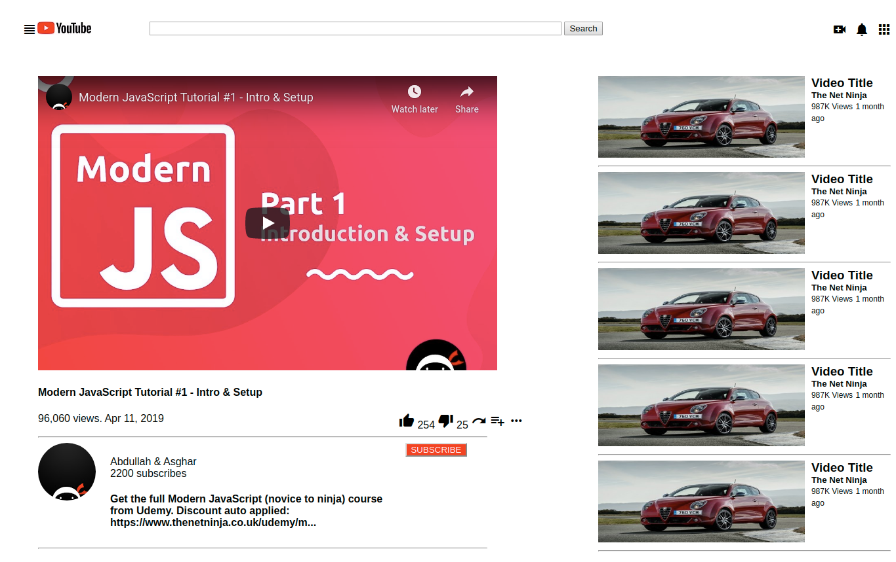

# Youtube-video-player

Youtube-video-player as our first microverse project
This is a simple clone of Youtube video page. We recreated the Youtube video page by adding video elements and associated navigation and recommended videos section.

In this page we created:
1. Navbar with logo and icons that allows navigation and links to different parts of the app
2. Video player with the video section, video title and description. It also has a section with creator avatar, the number of views, likes, dislikes, share, save and subscription icons.
3. Sidebar recommendations where recommended videos are shown with their title, number of views and author name.

# Built With
Languages used: HTML5 and CSS3.

# Authors
* Author1
  * Github: [@beyk](https://github.com/beyk)

* Author2
  * Github: [@anewman15](https://github.com/anewman15)
  * LinkedIn: [aanuman15](https://www.linkedin.com/in/aanuman15/)

# Live Version
Live version is available [here](https://rawcdn.githack.com/beyk/Youtube-video-player/90dfe270cd6071a0576ea7cd3e9fa2d7c24f15a3/Youtube-clone.html)